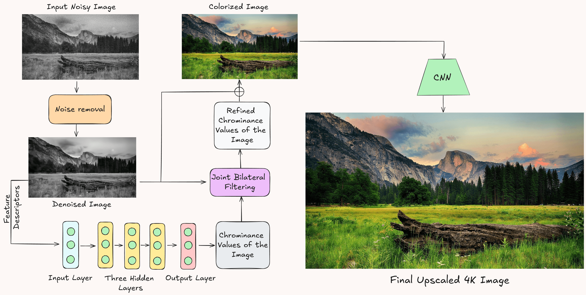
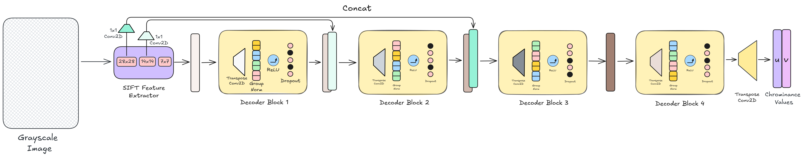
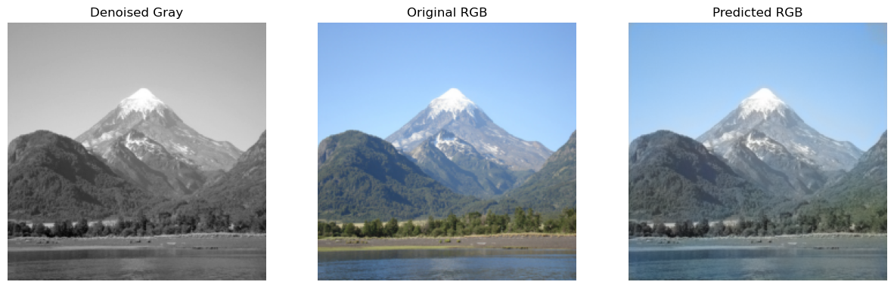
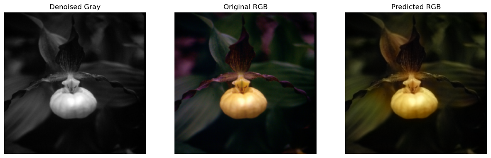
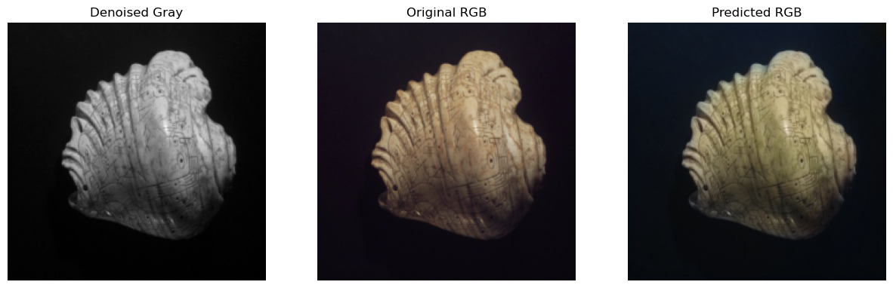
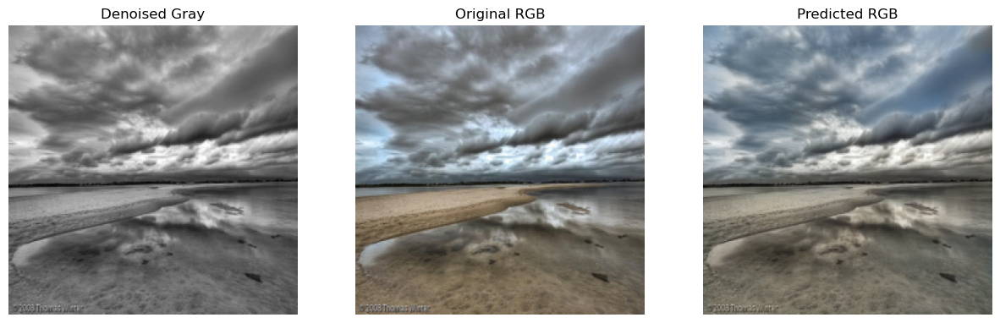

## Restoring Classics to 4K

The repository contains the implementation of an automated method for denoising and colorizing noisy, grayscale images simulating old movies, leveraging image-processing algorithms to produce realistic and contextually appropriate colors. 

Architecture Diagram</img>

 Chrominance Values Extraction </img>

Our detailed findings can be found in a comprehensive report here: [_link_](./Project_Report.pdf)

Following are the results obtained on some sample in-the-wild images:

</img>
</img>
</img>
</img>

More such results can be found here in our project slides here: [_link_](https://tinyurl.com/dip-slides-deck).

_Work done in collaboration with [Gnana Prakash](https://github.com/GnanaPrakashSG2004)_.
